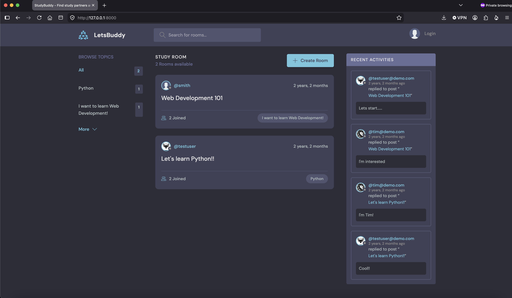
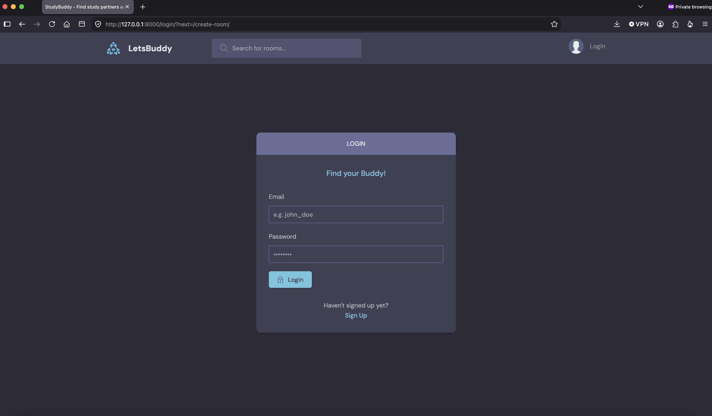
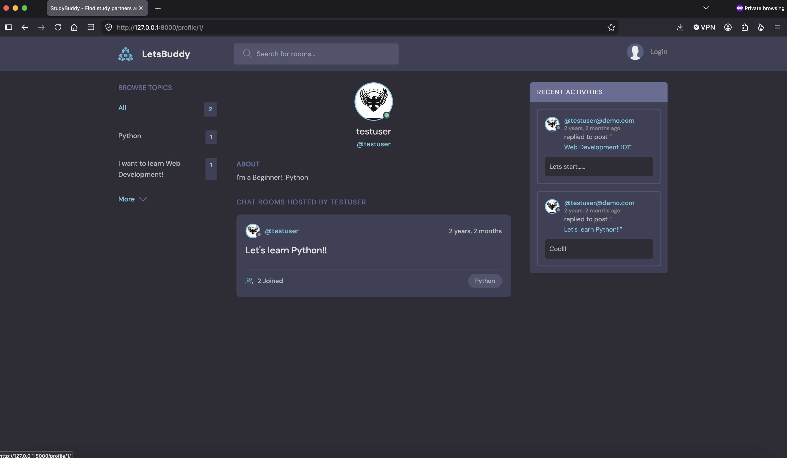

# LetsBuddy

LetsBuddy is a Django-powered community and discussion platform where users create topic-based chat rooms, join conversations, and connect with others around shared interests. Think of it as a lightweight StudyBuddy/Discord-style forum: create a room under a topic, invite discussion, and chat in real time via threaded messages.

<!--
  Add your own screenshots to a `screenshots/` folder in the repo root
  and update the paths below to match your file names.
-->

## Screenshots

| Room View | Login / Register | User Profile |
|---|---|---|
|  |  |  |

## Features

- 🔐 **Custom authentication** — email-based login/register/logout with a custom `User` model (name, bio, avatar)
- 💬 **Rooms** — create, edit, and delete discussion rooms tied to a topic
- 🏷️ **Topics** — organize and search rooms by topic
- 📝 **Threaded messages** — chat within a room; joining a room happens automatically when you post
- 🔎 **Search** — search rooms by topic, name, or description directly from the home page
- 👤 **User profiles** — view any user's rooms and message history; edit your own profile and avatar
- 📰 **Activity feed** — see the latest messages across all rooms in one place
- 🔒 **Permissions** — only a room's host can edit/delete it; only a message's author can delete it
- 🌐 **REST API** — read-only JSON endpoints (via Django REST Framework) for rooms
- 🛠️ **Admin panel** — manage Users, Rooms, Topics, and Messages via Django admin

## Tech Stack

- **Backend:** Python, Django 5
- **API:** Django REST Framework, django-cors-headers
- **Database:** SQLite
- **Frontend:** Django templates (HTML), vanilla CSS & JavaScript
- **Auth:** Django's built-in auth system with a custom user model

## Project Structure

```
LETS_BUDDY/
├── base/                  # Main app: models, views, forms, templates
│   ├── api/               # REST API (serializers, views, urls)
│   ├── migrations/
│   └── templates/base/
├── letsbuddy/             # Project settings, root URLs, WSGI/ASGI
├── static/                # CSS, JS, images/icons
├── templates/             # Shared/base templates (navbar, main layout)
├── manage.py
└── db.sqlite3
```

## Getting Started

### Prerequisites

- Python 3.11+
- pip

### Installation

1. Clone the repository
   ```bash
   git clone https://github.com/<your-username>/LETS_BUDDY.git
   cd LETS_BUDDY
   ```

2. Create and activate a virtual environment
   ```bash
   python3 -m venv venv
   source venv/bin/activate      # macOS/Linux
   venv\Scripts\activate         # Windows
   ```

3. Install dependencies
   ```bash
   pip install django djangorestframework django-cors-headers
   ```
   > 💡 If you generate a `requirements.txt` (`pip freeze > requirements.txt`), replace this step with `pip install -r requirements.txt`.

4. Apply migrations
   ```bash
   python manage.py migrate
   ```

5. Create a superuser (optional, for admin access)
   ```bash
   python manage.py createsuperuser
   ```

6. Run the development server
   ```bash
   python manage.py runserver
   ```

7. Visit `http://127.0.0.1:8000/` in your browser.

## API Endpoints

| Method | Endpoint | Description |
|---|---|---|
| GET | `/api/` | List available API routes |
| GET | `/api/rooms/` | List all rooms |
| GET | `/api/rooms/<id>/` | Retrieve a single room |

## Roadmap / Ideas

- [ ] Real-time messaging with WebSockets
- [ ] Notifications for new messages
- [ ] Room-level moderation tools
- [ ] Write/create endpoints for the API

## License

This project is licensed under the [MIT License](LICENSE).

## Contributing

Contributions, issues, and feature requests are welcome. Feel free to check the [issues page](https://github.com/<your-username>/LETS_BUDDY/issues) if you want to contribute.
